<div align="center">

# SGMM — Heavy Machinery Maintenance Management

**Track a fleet of heavy equipment, schedule and execute work orders, consume spare parts from a real inventory, and settle every job with a costed, immutably audited record.**

A three-service system: a React SPA, a Hono/Better-Auth identity server, and a FastAPI backend built on hexagonal DDD with vertical slices — all behind a single origin.

<br />


</div>

---

## What this is

A workshop that runs excavators, bulldozers and haul trucks has a recurring
problem: knowing which machine is down, who is working on it, which parts left
the warehouse, and what the job actually cost. SGMM is the system of record for
that.

A planner registers the fleet and schedules a work order against a machine and a
mechanic. The mechanic starts it — which automatically flips the machine to
`EN_MANTENIMIENTO` — draws spare parts from the warehouse, and settles the order
when the work is done. **Settlement is where the accounting happens**: each part's
price is snapshotted at that moment, physical stock is decremented, the machine
returns to `ACTIVA`, and the next service target is computed from the machine's
current hour meter.

Every one of those state changes is written to an **immutable forensic audit log**
in the same database transaction as the operation itself — so the log can never
drift from reality, and it cannot be edited or deleted afterwards.

---

## Screenshots

All screenshots are of the running stack with seeded demo data — no mockups.
Details and regeneration steps in the [screenshot notes](docs/screenshots/README.md).

### Operations dashboard

Fleet distribution, open work orders, stock alerts and rolling cost statistics.

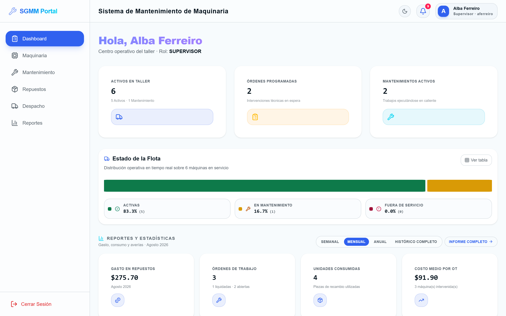

### Fleet and work orders

<table>
<tr>
<td width="50%">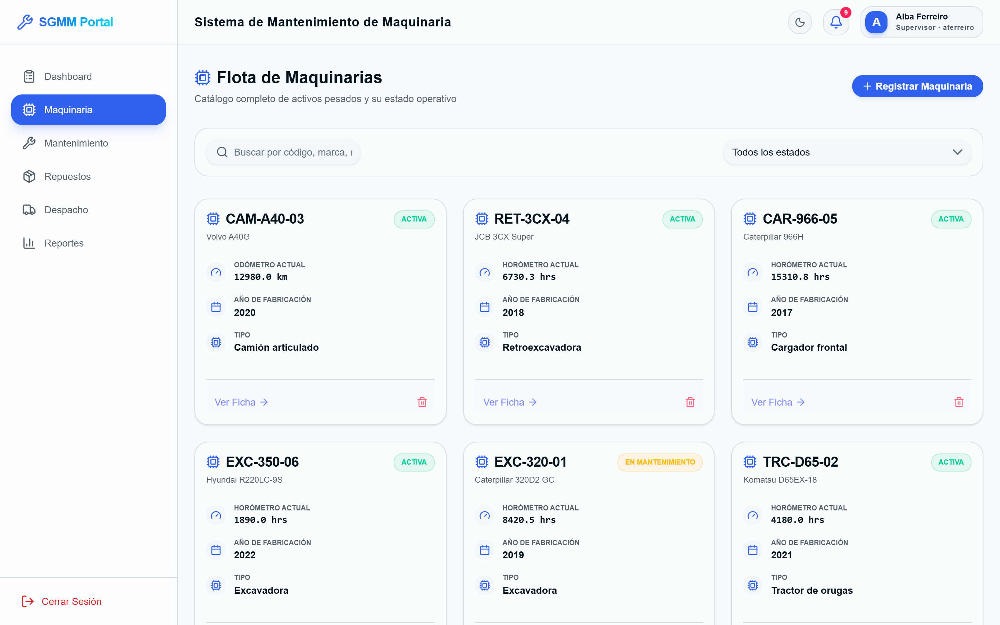</td>
<td width="50%">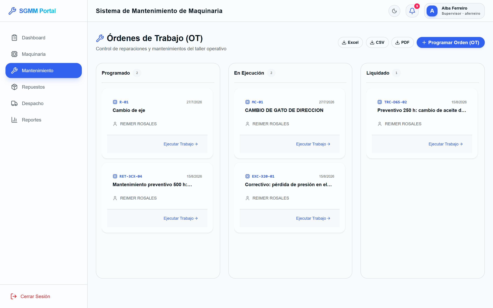</td>
</tr>
<tr>
<td align="center"><em>Fleet catalogue — status, hour meter, import/export</em></td>
<td align="center"><em>Work orders across the lifecycle</em></td>
</tr>
<tr>
<td width="50%">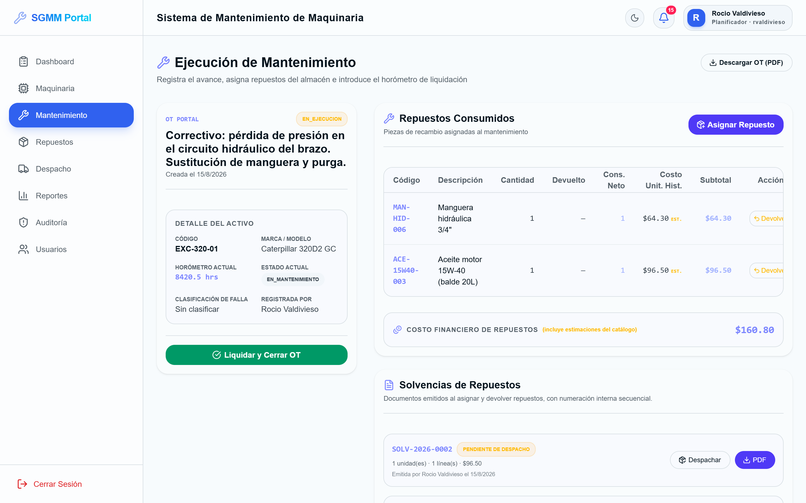</td>
<td width="50%">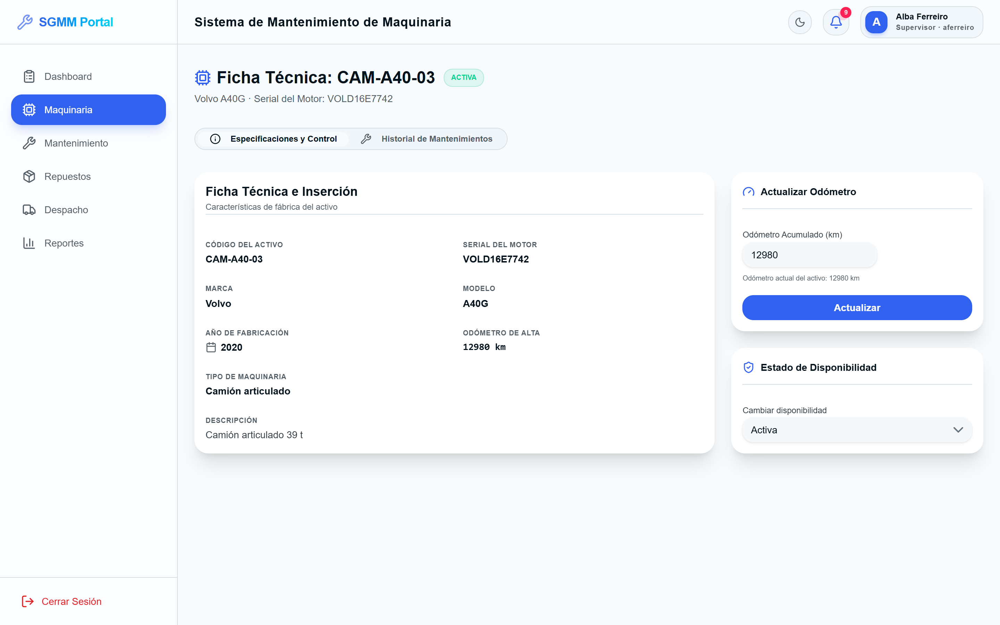</td>
</tr>
<tr>
<td align="center"><em>Execution — parts consumed, historical unit cost, settle &amp; close</em></td>
<td align="center"><em>Machine record and technical history</em></td>
</tr>
</table>

### The forensic audit log

Immutable, read-only, filterable by entity, operation and date. Actor IDs are
resolved to names at query time.


### Inventory, dispatch and reporting

<table>
<tr>
<td width="50%">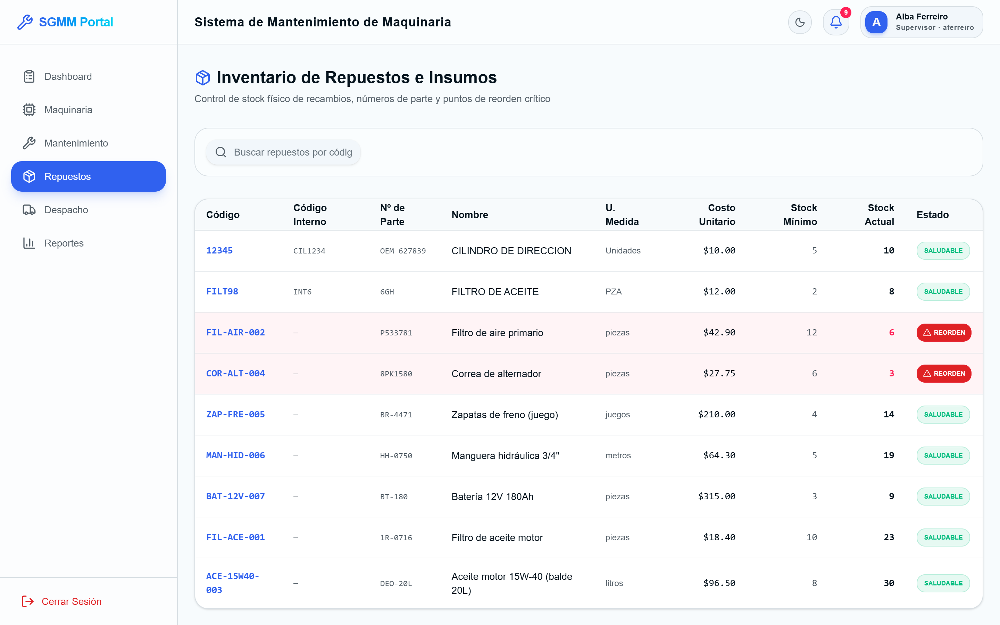</td>
<td width="50%">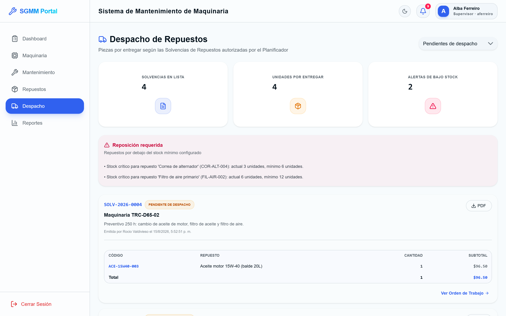</td>
</tr>
<tr>
<td align="center"><em>Spare parts — stock vs. minimum</em></td>
<td align="center"><em>Warehouse dispatch</em></td>
</tr>
<tr>
<td width="50%">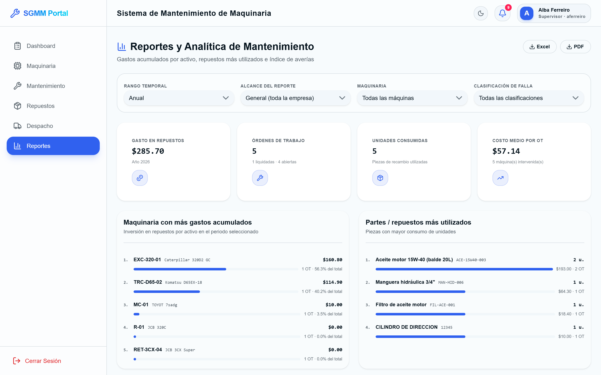</td>
<td width="50%">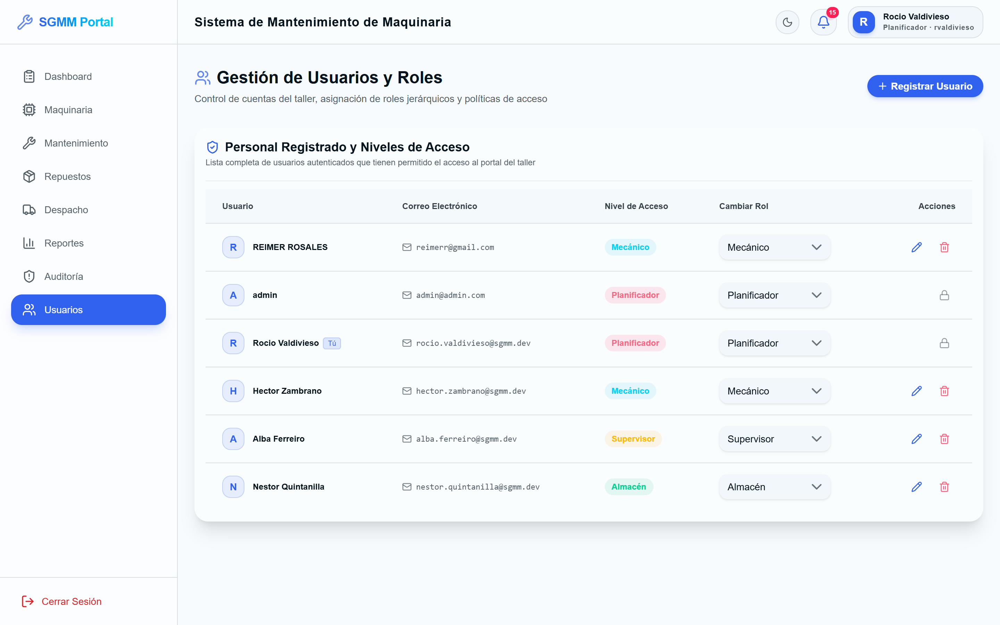</td>
</tr>
<tr>
<td align="center"><em>Analytical reports and exports</em></td>
<td align="center"><em>Users and roles (Planificador only)</em></td>
</tr>
</table>

### Light and dark

<table>
<tr>
<td width="50%">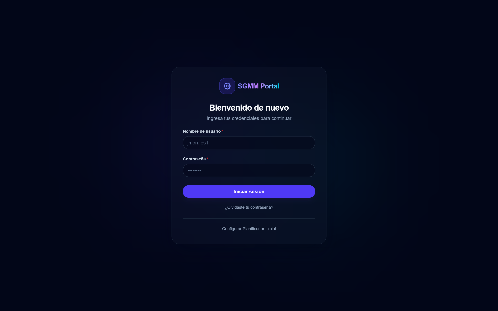</td>
<td width="50%">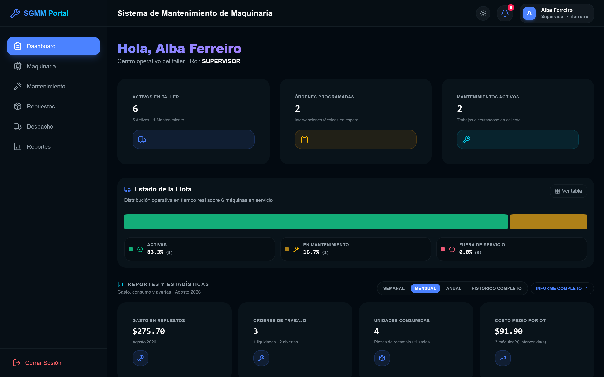</td>
</tr>
</table>

---

## Features

| | |
| --- | --- |
| 🚜 **Fleet register** | Machines with code, motor serial, brand/model, location and a hour meter that **can only increase**. Status: `ACTIVA`, `EN_MANTENIMIENTO`, `FUERA_DE_SERVICIO`, `DADA_DE_BAJA`. Bulk import from a downloadable template, plus Excel/PDF export. |
| 🔧 **Work-order lifecycle** | A strict finite state machine — `PROGRAMADO → EN_EJECUCION → LIQUIDADO`. Any invalid transition raises a domain exception rather than corrupting state. |
| 💰 **Costing at settlement** | Settling snapshots each part's `unit_cost_at_time`, decrements physical stock, returns the machine to `ACTIVA`, and computes the next service target from the current hour meter. Later price changes never rewrite historical orders. |
| 📦 **Inventory & dispatch** | Spare parts with current/minimum stock, part number, internal code and dual-currency cost. Parts assigned to an order generate a **Solvencia** document — the warehouse's dispatch voucher, with its own `PENDIENTE_DESPACHO → DESPACHADO` lifecycle and a PDF. |
| 🔔 **Preventive alerts** | A sweep raises `LOW_STOCK`, `MAINTENANCE_DUE` and `COMPONENT_SERVICE_DUE`. Maintenance plans are per-component and measured either by **usage** (hours/km) or **elapsed days**, with a configurable warning margin. |
| 🛡️ **Immutable audit log** | Written in the same transaction as the operation. SQLAlchemy event listeners block `UPDATE` and `DELETE` at the ORM layer, so the log is append-only by construction. |
| 📊 **Analytical reporting** | Cost reports, fleet status, per-machine technical history, and failure-category analytics — exportable to Excel, CSV and PDF. |
| 👥 **Four roles, enforced server-side** | `Planificador`, `Supervisor`, `Mecánico`, `Almacén`. Roles travel in an RS256 JWT and are checked per endpoint; the UI hides what the role cannot do, but the backend is the authority. |
| 🗑️ **Soft delete** | Nothing is physically removed. `is_active = false` preserves referential history — and only the Planificador sees archived records. |

---

## The work-order lifecycle

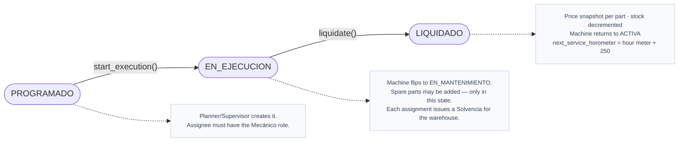

Total cost is **not** stored as a column — it is derived, so it always reflects
the snapshotted parts and the mechanic's rate:

```
Parts cost   = Σ (quantity_requested × unit_cost_at_time)
Labour cost  = hours_worked × hourly_rate      (from user_metadata)
────────────────────────────────────────────────────────────────
Total        = Parts cost + Labour cost
```

---

## Architecture

Three services behind **one origin**. The browser only ever talks to the web
container's nginx, which reverse-proxies `/api/auth/*` and `/trpc/*` to the
identity server and `/api/*` to the FastAPI backend. No CORS, no cross-site
cookies.

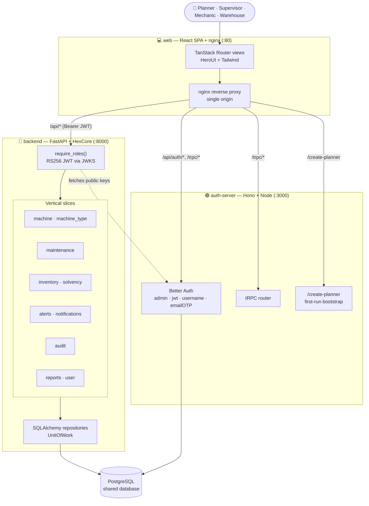

### One database, two owners

The Python backend and the TypeScript identity server **share one PostgreSQL
database**. Better Auth (via Drizzle) owns `user`, `session`, `account` and
`jwks`; HexCore (via SQLAlchemy + Alembic) owns `machines`, `maintenance_orders`,
`spare_parts`, `audit_logs`, `user_metadata` and the rest.

That is why the backend can resolve an actor ID to a display name with a plain
`SELECT id, name FROM "user" WHERE id IN (...)` instead of an HTTP round trip —
one query resolves every row on an audit page.

### How a request is authenticated

```
Browser ──cookie──► auth-server            (Better Auth session)
        ◄──── RS256 JWT (role in claims) ──┘
Browser ──Authorization: Bearer <JWT>──► backend
                                          │ verifies signature against JWKS
                                          │ normalises role → UserRole
                                          └ require_roles([...]) or 403
```

Roles are normalised defensively: `_missing_` on the `UserRole` enum maps
legacy database values (`"Administrador"`, `"admin"`) and Better-Auth
identifiers (`"planner"`, `"warehouse"`, `"mechanic"`) onto the current enum, so
neither old rows nor JWTs break validation.

---

## Roles

| Role | Can |
| --- | --- |
| **Planificador** | Everything. Schedules work orders, manages users, reads the audit log, sees soft-deleted records. *(Formerly `Administrador` — the old value still resolves.)* |
| **Supervisor** | Registers and manages machines and work orders. No audit log, no user management, does not see archived records. |
| **Mecánico** | Updates hour meters, starts orders, records spare parts, settles orders. |
| **Almacén** | Dispatches the Solvencia documents that release parts from the warehouse. |

---

## Tech stack

<table>
<tr><th align="left">Layer</th><th align="left">Choices</th></tr>
<tr>
<td><b>Frontend</b><br /><code>apps/web</code></td>
<td>React · TypeScript · <b>TanStack Start</b> + Router + Query + Form · <b>HeroUI</b> · Tailwind CSS · tRPC client · Better-Auth client · <code>next-themes</code> · Sonner · Vite</td>
</tr>
<tr>
<td><b>Identity</b><br /><code>apps/server</code></td>
<td><b>Hono</b> on Node · <b>Better Auth</b> (<code>admin</code>, <code>jwt</code>, <code>username</code>, <code>emailOTP</code>) · <b>tRPC</b> server · <b>Drizzle ORM</b></td>
</tr>
<tr>
<td><b>Backend</b><br /><code>apps/backend</code></td>
<td><b>Python 3.12</b> · <b>FastAPI</b> · <b>HexCore 2.0</b> (hexagonal/DDD framework) · SQLAlchemy 2 async (asyncpg) · Alembic · PyJWT + cryptography · ReportLab (PDF) · openpyxl (Excel)</td>
</tr>
<tr>
<td><b>Shared packages</b></td>
<td><code>packages/db</code> (Drizzle schema) · <code>packages/auth</code> · <code>packages/api</code> (tRPC routers) · <code>packages/ui</code> (shadcn/ui) · <code>packages/env</code> · <code>packages/config</code></td>
</tr>
<tr>
<td><b>Infrastructure</b></td>
<td>Docker Compose · PostgreSQL 15 · nginx · Turborepo · pnpm workspaces · Dokploy</td>
</tr>
</table>

---

## Repository structure

```
mantainer-system/
├── apps/
│   ├── web/          # React SPA (TanStack Start) + nginx single-origin proxy
│   ├── server/       # Hono identity server — Better Auth, tRPC, bootstrap
│   └── backend/      # FastAPI + HexCore — all business logic
├── packages/
│   ├── db/           # Drizzle schema & migrations (auth tables)
│   ├── auth/         # Better Auth configuration
│   ├── api/          # tRPC routers
│   ├── ui/           # Shared shadcn/ui primitives
│   ├── env/          # Zod-validated environment
│   └── config/       # Shared TypeScript config
├── docs/screenshots/ # UI screenshots
├── SGMM_Documentacion_Tecnica.md   # Exhaustive technical documentation (ES)
└── docker-compose*.yml
```

The backend is documented in depth in **[`apps/backend/README.md`](apps/backend/README.md)**.
For a line-by-line walkthrough of the architecture, database dictionary and SQL
queries, see **[`SGMM_Documentacion_Tecnica.md`](SGMM_Documentacion_Tecnica.md)** (Spanish).

---

## Running it

### Docker Compose (full stack)

```bash
docker compose up -d --build
```

Brings up PostgreSQL, both migration jobs (Drizzle then Alembic), the identity
server, the FastAPI backend and the nginx-served SPA.

| Service | URL |
| --- | --- |
| Web app | http://localhost |
| Identity server | http://localhost:3000 |
| Backend (Swagger UI) | http://localhost:8000/docs |
| PostgreSQL | `localhost:5432` — `postgres` / `postgres_secure_password` / `sgmm_auth_db` |

**First run:** open http://localhost/setup-admin and create the initial
Planificador with the creation key `SGMM-CLAVE-ADMIN-2026`. Public sign-up is
disabled by design — every later account is created from the Users screen.

> [!NOTE]
> The browser reaches everything through the web container on port 80; the
> frontend resolves its API origin at runtime, so the same build works locally
> and behind your production reverse proxy.

### Local development

```bash
pnpm install
cd apps/backend && uv sync          # or: pip install -e .

pnpm run dev                        # web + identity server
cd apps/backend && fastapi dev src/main.py
```

### Scripts

| Command | Does |
| --- | --- |
| `pnpm run dev` | Start web + identity server via Turborepo |
| `pnpm run build` | Build all JS apps |
| `pnpm run check-types` | Type-check the workspace |
| `pnpm run db:push` / `db:generate` / `db:migrate` / `db:studio` | Drizzle schema workflow (auth tables) |
| `alembic upgrade head` *(in `apps/backend`)* | Apply backend migrations |
| `pytest` *(in `apps/backend`)* | Backend test suite |

---

## API surface

61 endpoints under `/api`, all requiring a Bearer JWT and role authorisation.
Interactive docs at `http://localhost:8000/docs`.

| Area | Highlights |
| --- | --- |
| **Machines** | CRUD + `query`, hour-meter and status updates, soft delete, `import`, `export`, `import-template` |
| **Machine types** | Catalogue used to classify the fleet |
| **Maintenance** | Create, `start`, `spare-parts`, `liquidate`, part `return`, failure-category catalogue and assignment, per-order export |
| **Inventory** | CRUD, stock and price updates, `import`, `export` |
| **Solvencies** | List, detail, `pdf`, `dispatch` |
| **Alerts** | Sweep (`check`), resolve, and full CRUD for preventive maintenance plans incl. `register-service` |
| **Notifications** | List, mark one read, mark all read |
| **Audit logs** | Read-only list, `query`, and `facets` for the filter UI |
| **Reports** | `costs`, `analytics`, `fleet-status`, `technical-history/{machine_id}`, each with an export variant |
| **User metadata** | `me`, `mechanics`, per-user metadata and hourly rate |

---

## Engineering notes

- **Hexagonal, enforced.** Every slice has `domain/`, `application/` and
  `infrastructure/`. The domain never imports SQLAlchemy; coupling points
  inward only.
- **Audit as an invariant, not a feature.** The log is written inside the
  business transaction — if the operation rolls back, so does its log entry, so
  orphaned or missing entries are impossible. Immutability is enforced at the
  ORM layer, not by convention.
- **Historical prices.** `maintenance_spare_parts.unit_cost_at_time` is a
  snapshot. Re-pricing the catalogue tomorrow cannot rewrite what a job cost
  last month.
- **Monotonic hour meters.** A machine's hour meter can only increase — the
  domain rejects a lower reading, because a decreasing meter means either a
  typo or a swapped instrument, and both need a human.
- **Soft delete with role-scoped visibility.** `is_active = false` keeps
  referential history intact; only the Planificador sees archived rows, which is
  what makes the soft delete safe to expose.
- **Defensive role parsing.** A renamed role (`Administrador` → `Planificador`)
  did not require a data migration: the enum resolves legacy values and
  Better-Auth identifiers alike.

---

## License

Released under the [MIT License](LICENSE).
