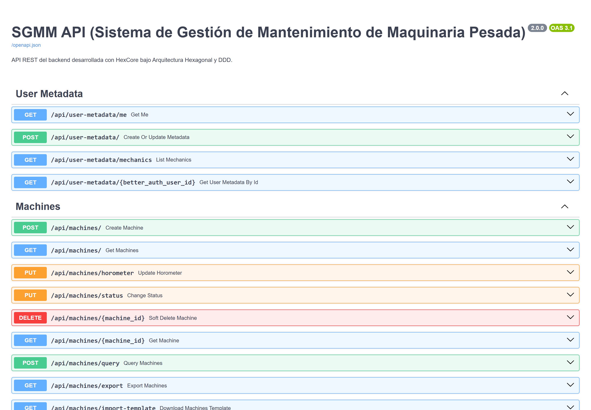
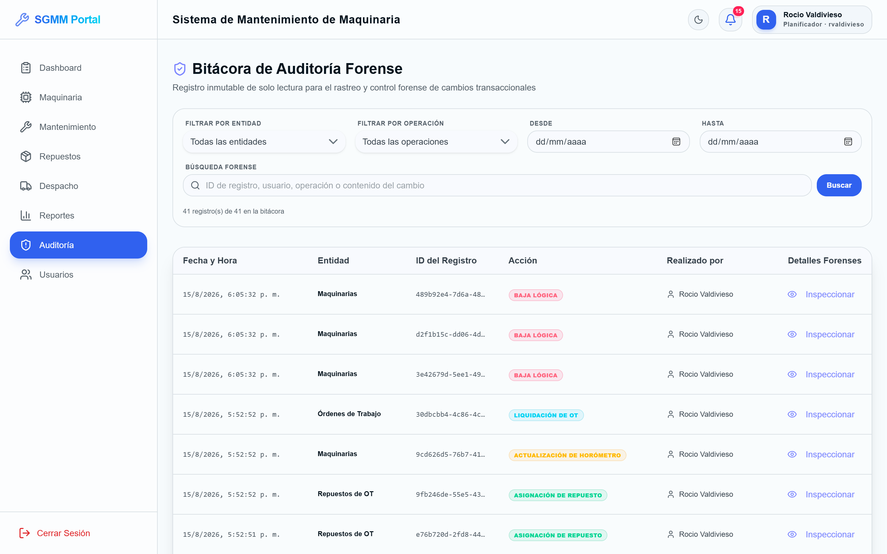

<div align="center">

# SGMM Backend — FastAPI + HexCore

**The business core of [SGMM](../../README.md):** fleet register, work-order lifecycle, inventory and dispatch, preventive alerts, analytical reporting — and an immutable forensic audit log underneath all of it.


</div>

---

## What this service owns

Everything except identity. Authentication lives in the Hono server
([`apps/server`](../server)); this service receives an **RS256 JWT**, verifies it
against that server's JWKS endpoint, maps the `role` claim onto a domain role and
authorises every endpoint.

It is never exposed directly — the browser reaches it through the web
container's nginx under `/api/*`.

<table>
<tr>
<td width="50%"></td>
<td width="50%"></td>
</tr>
<tr>
<td align="center"><em>Auto-generated OpenAPI docs at <code>/docs</code></em></td>
<td align="center"><em>What the audit slice produces, rendered by the SPA</em></td>
</tr>
</table>

---

## Architecture

**Hexagonal (Ports & Adapters) + Domain-Driven Design, organised as vertical
slices.** Code is grouped by business capability, never by technical layer.

```
src/
├── main.py                 ← FastAPI entrypoint; registers every slice router
├── features/
│   ├── machine/            ← Fleet register
│   ├── machine_type/       ← Machine classification catalogue
│   ├── maintenance/        ← Work orders: the FSM and costing
│   ├── inventory/          ← Spare parts and stock
│   ├── solvency/           ← Warehouse dispatch documents
│   ├── alerts/             ← Alert sweep + preventive maintenance plans
│   ├── notifications/      ← Per-user notification feed
│   ├── audit/              ← Immutable forensic log
│   ├── reports/            ← Analytics, costs, fleet status, history
│   ├── user/               ← Role metadata and hourly rates
│   └── auth/               ← JWT decoding, role parsing, require_roles()
├── shared/infrastructure/database/
└── alembic/                ← Migrations
```

Each slice repeats the same three layers:

| Layer | Holds | May import |
| --- | --- | --- |
| `domain/` | Entities, domain services, exceptions, enums | Nothing outward |
| `application/` | Use cases, DTOs, commands | `domain/` |
| `infrastructure/` | FastAPI routes, SQLAlchemy models, repositories | `domain/` + `application/` |

**The golden rule:** the domain never imports SQLAlchemy. Dependencies point
inward, always.

### HexCore base classes

HexCore is the in-house framework layered on FastAPI. Each slice inherits from it:

| Base class | Purpose |
| --- | --- |
| `BaseEntity` | Domain entity with `id: UUID`, `is_active`, `created_at`, `updated_at` |
| `BaseDomainService` | Domain service operating over entities |
| `UseCase[TCommand, TResponse]` | Typed use case: takes a command, returns a response |
| `BaseModel` (ORM) | SQLAlchemy model with UUID PK and automatic timestamps |
| `SQLAlchemyCommonImplementationsRepo` | Generic CRUD repository |
| `SqlAlchemyUnitOfWork` | Wraps the DB session in one transaction; injected into routes and use cases |

### Request lifecycle

```
POST /api/machines/  + Bearer JWT
  │
  ├─[1] FastAPI router
  │      Depends(get_uow)                  → injects the session
  │      Depends(require_roles([...]))     → decodes RS256 JWT via JWKS,
  │                                          normalises role, 403 on mismatch
  ├─[2] CreateMachineUseCase.execute(command)
  │      async with self.uow:              → opens the transaction
  ├─[3] MachineDomainService.create_machine()
  │      builds Machine(status=ACTIVA, …)  → pure business rules
  ├─[4] Repository → SQLAlchemy
  │      INSERT INTO machines …
  │      INSERT INTO audit_logs …          → same transaction, always
  ├─[5] COMMIT
  └─[6] 201 Created + MachineResponse
```

---

## Core business logic

### Work orders — a strict finite state machine

```
PROGRAMADO ──start_execution()──► EN_EJECUCION ──liquidate()──► LIQUIDADO
```

Any other transition raises `InvalidMaintenanceTransitionException`.

- **Create** validates that the machine exists and that the assignee actually
  holds the `Mecánico` role.
- **Start** flips the order to `EN_EJECUCION` *and* the machine to
  `EN_MANTENIMIENTO`, atomically.
- **Add spare parts** is rejected unless the order is `EN_EJECUCION` — the
  entity guards this itself, not the route.
- **Settle** (`liquidate`) is where the accounting happens:
  1. optionally update the machine's hour meter from the payload;
  2. `next_service_horometer = current_horometer + 250`;
  3. for each part: **snapshot `unit_cost_at_time`**, then decrement physical
     stock (raising if it would go negative);
  4. return the machine to `ACTIVA`.

Total cost is derived, never stored:

```
Parts   = Σ (quantity_requested × unit_cost_at_time)
Labour  = hours_worked × hourly_rate        (user_metadata)
Total   = Parts + Labour
```

### Solvencies — the warehouse dispatch voucher

Assigning parts to an order issues a `SparePartSolvency` with a sequential
internal code, moving `PENDIENTE_DESPACHO → DESPACHADO` (or `ANULADA`). Each
line **copies the part's code and name at issue time**, so a voucher stays
readable even if the catalogue entry is later renamed or archived. Rendered to
PDF with ReportLab.

### Alerts and preventive plans

The sweep (`POST /api/alerts/check`) raises three alert types:

| Type | Raised when |
| --- | --- |
| `LOW_STOCK` | A part's `stock_current` drops below `stock_minimum` |
| `MAINTENANCE_DUE` | A machine is due for scheduled service |
| `COMPONENT_SERVICE_DUE` | A per-component `MaintenancePlan` target is reached |

A `MaintenancePlan` measures its interval either by **usage** (`USO` — hours or
km, matching the machine's `horometer_unit`) or by **elapsed days** (`TIEMPO`),
with a `warning_threshold` margin so the alert fires *before* the target.

### The forensic audit log

Answers "who did what, and when" — and is designed so the answer cannot be
tampered with.

- **Same transaction.** The log entry is written inside the business
  transaction. If the operation rolls back, so does the entry — no orphans, no
  gaps.
- **Immutable at the ORM layer.** SQLAlchemy event listeners abort the
  operation before any SQL is generated:

  ```python
  @event.listens_for(AuditLogModel, "before_update")
  def block_audit_log_update(mapper, connection, target):
      raise PermissionError("La bitácora de auditoría es inmutable…")
  ```

- **Names resolved at read time.** `performed_by` stores the raw Better-Auth ID;
  the route resolves every ID on a page with a single
  `SELECT id, name FROM "user" WHERE id IN (...)`.
- **Planificador only.**

---

## Roles & permissions

Roles arrive in the JWT and are normalised by `UserRole._missing_`, which maps
legacy database values (`"Administrador"`, `"admin"`) and Better-Auth
identifiers (`"planner"`, `"warehouse"`, `"mechanic"`) onto the current enum —
so a role rename needed no data migration.

| Endpoint | Planificador | Supervisor | Mecánico | Almacén |
| --- | :---: | :---: | :---: | :---: |
| `POST /api/machines/` | ✅ | ✅ | ❌ | ❌ |
| `GET /api/machines/` | ✅ *(sees archived)* | ✅ | ✅ | ✅ |
| `PUT /api/machines/{id}/horometer` | ✅ | ✅ | ✅ | ❌ |
| `DELETE /api/machines/{id}` (soft) | ✅ | ✅ | ❌ | ❌ |
| `POST /api/maintenance/` | ✅ | ✅ | ❌ | ❌ |
| `POST /api/maintenance/{id}/start` | ✅ | ✅ | ✅ | ❌ |
| `POST /api/maintenance/{id}/liquidate` | ✅ | ✅ | ✅ | ❌ |
| `PUT /api/solvencies/{id}/dispatch` | ✅ | ✅ | ❌ | ✅ |
| `GET /api/audit-logs/` | ✅ | ❌ | ❌ | ❌ |
| `POST /api/user-metadata/` | ✅ | ❌ | ❌ | ❌ |

---

## Data model

Owned by this service (HexCore/SQLAlchemy):

| Table | Notes |
| --- | --- |
| `machines` | `code` and `motor_serial` unique; `current_horometer` monotonic; `horometer_unit` ∈ Horas/Kilómetros/Millas |
| `machine_types` | Classification catalogue |
| `maintenance_orders` | FK to machine and to `user_metadata.id` (not the Better-Auth ID) |
| `maintenance_spare_parts` | Join table carrying `quantity_requested` and the **price snapshot** |
| `spare_parts` | `stock_current` / `stock_minimum`, part number, internal code, local + USD cost |
| `spare_part_solvencies` / items | Dispatch vouchers with copied part code/name |
| `alerts`, `maintenance_plans` | Preventive maintenance |
| `audit_logs` | Append-only; `payload` as JSON text |
| `user_metadata` | Business role + `hourly_rate`, keyed by `better_auth_user_id` |

Owned by the identity server (Drizzle) and read here **read-only**: `user`,
`session`, `account`, `jwks`.

> `GET /api/user-metadata/mechanics` treats Better Auth as the source of truth
> for who is a mechanic, and idempotently provisions the matching
> `user_metadata` row — so assignment selectors populate with no manual step.

---

## Getting started

```bash
cd apps/backend
uv sync                       # or: pip install -e .

alembic upgrade head          # migrations
fastapi dev src/main.py       # dev server on :8000
```

Interactive OpenAPI docs: **http://localhost:8000/docs**

### Configuration

| Variable | Purpose |
| --- | --- |
| `DATABASE_URL` | Sync URL (psycopg2) — used by Alembic |
| `SQL_DATABASE_URL` | Sync URL for SQLAlchemy |
| `ASYNC_SQL_DATABASE_URL` | Async URL (asyncpg) for the app |
| `BETTER_AUTH_URL` | Identity server base URL (internal) |
| `JWKS_URL` | Public keys used to verify RS256 JWTs |
| `PORT` | Listen port (default 8000) |

### Tests

```bash
pytest              # asyncio_mode = auto, tests under tests/
```

---

## Dependencies of note

| Package | Why |
| --- | --- |
| `hexcore>=2.0.5` | Base entities, use cases, repositories, Unit of Work |
| `sqlalchemy[asyncio]` + `asyncpg` | Async persistence |
| `alembic` | Schema migrations |
| `pyjwt` + `cryptography` | RS256 verification via JWKS |
| `reportlab` | Solvency and report PDFs |
| `openpyxl` | Excel exports/templates with column auto-fit and currency formatting |
| `typer>=0.12,<0.26` | Pinned: HexCore's `async-typer` imports `clear`, removed in typer 0.26 |

---

## Contributing rules

1. **Never** import ORM models inside `domain/` or `application/`.
2. Write the audit entry **inside** the business transaction — never as a
   follow-up call.
3. Enforce state transitions on the **entity**, not in the route. A route may
   only translate HTTP into a command.
4. Prices consumed by a work order must be snapshotted, never read live from the
   catalogue at report time.
5. Never physically delete a record — flip `is_active` and let role-scoped
   visibility hide it.

---

## Related

- [Root README](../../README.md) — product overview, screenshots, running the stack
- [`SGMM_Documentacion_Tecnica.md`](../../SGMM_Documentacion_Tecnica.md) — exhaustive technical documentation (Spanish), incl. the data dictionary and pgAdmin guide
- [`apps/server`](../server) — Better Auth identity server and tRPC
- [`apps/web`](../web) — React SPA

## License

MIT — see [LICENSE](../../LICENSE) at the repository root.
